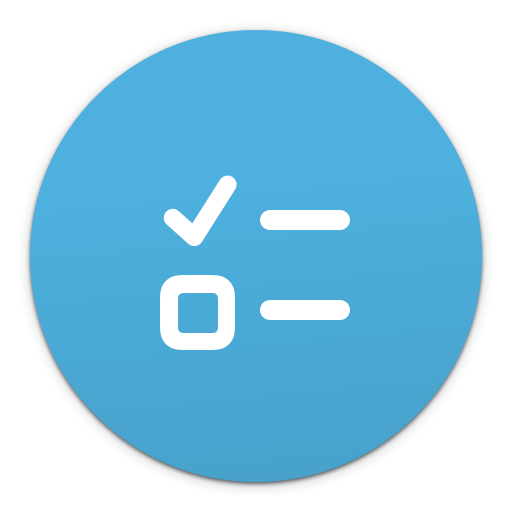
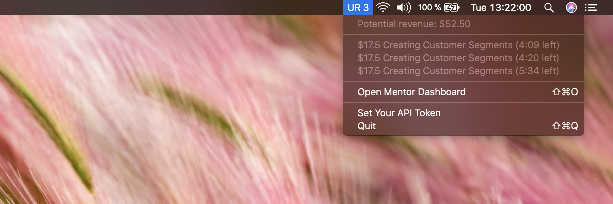

<h3 align='center'>
    <a href='#docs'>
        
    </a>
</h3>

<h1 id='urstatus' align='center'>URStatus</h1>
<h3 align='center'>Monitor the status of your Udacity Reviews queue from macOS menu bar</h3>

<h4 align='center'>
    <a href='https://github.com/kysely/urstatus/releases/latest'>
        
    </a>
</h4>

[](https://github.com/kysely/urstatus/releases/latest)


<br />

## Yeah I got Issues...
...but you got 'em too.
[So give 'em all to me and I'll give mine to you](https://github.com/kysely/urstatus/issues)

## Develop

Written in Python 3, runs on [`rumps`](https://github.com/jaredks/rumps).

I believe the code is self-explanatory; and few less comprehensible parts are
documented, so editing the source should be fairly easy.


```sh
# Run development version
make run

# Build .app file
make build
```

## Disclaimer

This is a third-party project and is not affiliated with [Udacity, Inc](https://udacity.com).

## License
[MIT](https://github.com/kysely/urstatus/blob/master/LICENSE)